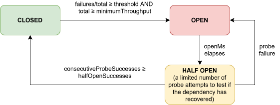

# Circuit breaker

A circuit breaker tracks the failure rate of an operation across a sliding window of observations. When the rate exceeds a configured threshold, the breaker opens and blocks further attempts, protecting a struggling dependency from additional load while it recovers. After a configurable delay it enters half-open state and allows a limited number of probe attempts through. Enough consecutive successes close it again, any failure re-opens it.

By default, both local and distributed breakers use the adapter's outcome classification: `failure` and `retryable` count as failures, `success` counts as success, and `ignored` is not recorded. Returned values are classified too, so an HTTP 503 can count as a failure even though fetch resolves. Outside retry, the breaker classifies only the final outcome of the retry sequence.

An explicit breaker `classify(error, isSuccess)` option overrides adapter classification. Its `isSuccess` argument indicates whether the wrapped execution resolved, regardless of how the adapter classifies the result.

## State machine



Valid transitions - enforced by the implementation and verified by property tests:

| From | To | Trigger |
|---|---|---|
| `closed` | `open` | failure ratio ≥ `failureThreshold` after ≥ `minimumThroughput` observations |
| `open` | `half-open` | `openMs` elapsed since last opened |
| `half-open` | `closed` | `halfOpenSuccesses` consecutive probe successes |
| `half-open` | `open` | any probe failure |

`closed → half-open`, `open → closed`, and `open → open` are impossible within a single transition.

## Sliding window

The window is a circular buffer of `windowSize` observations. On each observation the oldest entry is evicted if the buffer is full. The window resets to empty on every state transition. Observations from rejected attempts are never recorded.

Invariants verified by property tests:
- `failures + successes === observations` at all times.
- `observations ≤ windowSize` at all times.
- Opening never fires before `minimumThroughput` observations.
- A success-only trace never opens the breaker.
- `probesInFlight ≤ halfOpenProbes` at all times.

## Local

Each process tracks its own failure window independently. No coordinator or Redis connection is required. Two instances with the same name are completely independent, each owns its own in-process state.

```ts
import { circuitBreaker, operation } from "@gkoos/caracal"

const breaker = circuitBreaker.local({
  name: "partner-api",
  minimumThroughput: 10,  // minimum observations before the breaker may open
  failureThreshold: 0.5,  // open when ≥ 50% of the window are failures
  openMs: 10_000,         // stay open for 10s before allowing a probe
  halfOpenSuccesses: 2,   // consecutive probe successes needed to close
  halfOpenProbes: 1,      // max concurrent probes in half-open
  windowSize: 100,        // sliding window of last 100 observations
  classify: (err, isSuccess) => isSuccess ? "success" : "failure", // optional custom classifier
})

const op = operation({ name: "partner-api", adapter, policies: [breaker] })

breaker.snapshot()
// { coordination: "local", state, failures, successes, observations,
//   probesInFlight, halfOpenSuccesses }
```

Local attempts capture a generation at admission. Every state transition starts a new generation; results from older generations are discarded without changing the current window or probe counters. The caller still receives the original result or error. This prevents a late probe success from closing a breaker that another probe has already reopened.

## Errors

`CircuitOpenError` carries `policyName`, `coordination`, and `scope`.

---

## Distributed

The failure window, state, and probe budget are shared across all replicas via Redis. Each unique `(namespace, policy name, operation name, scope)` gets its own independent breaker state.

```ts
import { circuitBreaker } from "@gkoos/caracal"
import { createCoordinationClient, redisCircuitBreakerCoordinator } from "@gkoos/caracal/redis"

const redis = createCoordinationClient(process.env.REDIS_URL!)
await redis.connect()

const breaker = circuitBreaker.distributed({
  name: "partner-api",
  coordinator: redisCircuitBreakerCoordinator(redis, { namespace: "svc:prod" }),
  scope: (ctx) => `region:${String(ctx.metadata.region)}`,
  minimumThroughput: 20,
  failureThreshold: 0.5,
  openMs: 30_000,
  halfOpenProbes: 3,      // globally bounded concurrent probes per scope
  halfOpenSuccesses: 2,
  windowSize: 100,
  onCoordinatorError: "fail-open",  // or "fail-closed"
})
```

Place the circuit breaker outermost in the policy array so it observes the final outcome of each logical execution, after retries. A distributed breaker never silently falls back to local state on coordinator loss.

### Scope

The `scope` function maps each execution context to a string key. Everything sharing a key shares the same failure window and breaker state:

```ts
scope: (ctx) => `region:${String(ctx.metadata.region)}`   // one breaker per region
scope: (ctx) => `tenant:${String(ctx.metadata.tenantId)}` // one breaker per tenant
scope: () => "global"                                       // one breaker for all replicas
```

Use stable, non-secret values, scope keys are observable in the Redis keyspace. All processes using the same identity must use consistent configuration; this is an application responsibility.

### State storage

Two Redis keys are used per scope:

**State hash** stores `state`, `generation`, `openedAt`, `probeCount`, `probeSuccesses`. It is created by the first observation of a scope, so the window's epoch is on record from the start. A missing key is treated as closed. All state transitions are atomic Lua scripts using server-side timestamps.

TTL policy for the state hash:
- **OPEN / HALF_OPEN**: no TTL (`PERSIST`). Because a missing key is treated as closed, expiring a non-closed hash would silently admit unrestricted traffic, reset the window epoch (breaking the stale-result guarantee), and orphan any in-flight probe lease tokens.
- **CLOSED**: TTL of `max(openMs × 2, windowTtlMs)` for eventual cleanup of idle scopes. Expiring a closed key is safe only because that TTL outlives the window it governs - the hash is what remembers which epoch the retained observations belong to.

**Observations sorted set** each entry scored by Redis server timestamp. Entries older than `windowTtlMs` (default: `max(openMs × 3, 60_000)`) are pruned on each write, preventing unbounded growth after idle periods. The count-based eviction (`windowSize`) is the binding constraint under normal load; time-based pruning is a safety backstop for idle scopes.

### Generations, epochs and stale result rejection

`generation` is both the stale-result token and the window's epoch: members are stored as `gen:uuid:outcome`, and only members whose epoch equals the current generation count toward the window.

Every open/close cycle increments it. An attempt captures the generation at admission time; if the breaker has cycled before the attempt settles, the observation is discarded, it cannot corrupt the current window. This prevents a slow in-flight attempt from a previous generation from re-opening or re-closing the breaker after state has already moved on.

Cleanup cannot resurrect an old result. If the state hash is lost anyway - an eviction policy on a non-persistent replica, an administrative cleanup, a manual `DEL` - while observation members survive, the next observation **mints a new epoch** (a value that has never been used for that key) instead of restarting from a value those members would match. Members from the superseded epoch stay in the sorted set until `windowTtlMs` prunes them, but they are no longer counted, and an attempt holding a pre-loss generation is rejected as stale. A scope that has never been observed keeps generation 0, which is also why the cleanup TTL above is coupled to the window: the normal path should never lose an epoch while its members live.

### Coordinator-loss behaviour

Admission uses two sequential coordinator calls — `readState` then (if non-closed) `admitProbe` — so there are three distinct failure scenarios:

| Situation | Default behavior | Rationale |
|---|---|---|
| `readState` fails, **last known state was OPEN or HALF_OPEN** | `fail-closed` (reject) | The breaker was confirmed non-closed before the outage; admitting work removes the protection it exists to provide |
| `readState` fails, **last known state was CLOSED** (or no prior read has succeeded) | `onCoordinatorError` — default `fail-open` (allow attempt) | No evidence the breaker is open; blocking all traffic on a transient outage is usually worse than allowing some through |
| `readState` succeeds with OPEN/HALF_OPEN, then `admitProbe` fails | `fail-closed` (reject) | State was just confirmed non-closed; same reasoning as above |
| Observation Lua fails | Silently drop observation | One lost datapoint does not corrupt state; don't fail the caller |
| Probe settlement Lua fails | Drop settlement; probe token expires | Probe count recovers via lease expiry |

`onCoordinatorError` governs only the second row: when `readState` fails and no prior read has established that the scope is non-closed. Once a scope has been seen as OPEN or HALF_OPEN that knowledge is retained in process; a subsequent coordinator outage will fail-closed for that scope regardless of this setting. There is no automatic local fallback and no sticky policy-wide degraded state.

Retention is per `(operation, scope)` and covers **only non-closed states**. A CLOSED read, a probe settlement that closes the breaker, or an `admitProbe` response of `closed` discards the entry, because CLOSED and "never seen" are treated identically here. In-process memory therefore tracks the scopes currently believed OPEN or HALF_OPEN - the same scopes whose Redis state hash is kept without a TTL - rather than every scope ever observed.

### Half-open probe arbitration

- At most `halfOpenProbes` concurrent probes are admitted globally per scope. Enforced at the Redis level, not just per-process.
- Each probe holds a token in Redis whose sorted-set score is its deadline. A dead worker's token expires automatically, and the probe slot recovers without coordinator intervention; a result that arrives after the deadline is dropped as stale. The settlement script checks the deadline atomically, so an expired probe can neither close nor re-open the breaker, and the slot it still occupied is released.
- Leaving HALF_OPEN discards the probe tokens of that recovery window, so the next window starts with full capacity and a late settle from the superseded window is dropped rather than counted.
- `probeSuccesses` accumulates across all concurrent probes. The first worker to reach `halfOpenSuccesses` closes the breaker.
- Any probe failure takes priority: it re-opens the breaker and increments the generation.
- These dials interlock with the window counters (`minimumThroughput`, `failureThreshold`, `windowSize`, `windowTtlMs`); [Redis coordination](redis.md#keeping-the-breaker-knobs-consistent) lists the constraints and the symptoms of getting them wrong.

## Events

See [events and observability](events-and-observability.md) for the full event reference. Relevant events: `breaker.state-changed`, `breaker.rejected`, `breaker.observation`, `breaker.probe-started`, `breaker.observation-stale`, `breaker.coordinator-error`, `breaker.degraded`.
